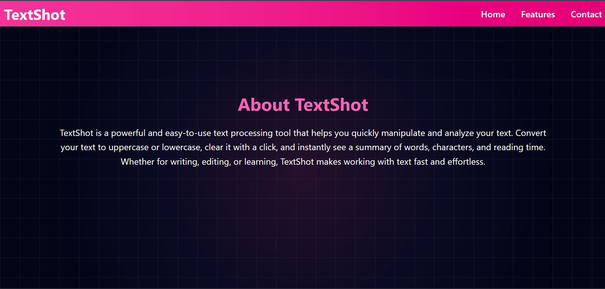

# TextShot

TextShot is a powerful and easy-to-use text processing tool that helps you quickly manipulate and analyze your text.  
Convert your text to uppercase or lowercase, clear it with a click, and instantly see a summary of words, characters, and reading time.  
Whether for writing, editing, or learning, TextShot makes working with text fast and effortless.

---

##  Features

- **Text Transformation**: Convert text to uppercase or lowercase instantly.  
- **Quick Reset**: Clear your text with a single click.  
- **Instant Summary**: Get word count, character count, and estimated reading time.  
- **Responsive Design**: Works seamlessly across desktop, tablet, and mobile.  
- **User-Friendly**: Minimal UI, simple interactions, fast results.  

---

##  Tech Stack

- **Frontend**: React + Vite  
- **Styling**: Tailwind CSS  

---

##  Review Images

### Home


### Feature1


### Feature2


### Feature3


### Contact


---

##  Setup Instructions

Follow these steps to run the project locally:

1. Clone the repository:
   ```bash
   git clone <your-repo-link>
   ```

2. Navigate into the project folder:
   ```bash
   cd textshot
   ```

3. Install dependencies:
   ```bash
   npm install
   ```

4. Start the development server:
   ```bash
   npm run dev
   ```

5. Open your browser and visit:
   ```
   http://localhost:5173
   ```


